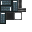
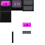

# Crystal Nexus Mod - Block Tutorial & Guide

This guide covers the major functional blocks in the Crystal Nexus mod, detailing what they do and how to use them. Decorative blocks (like colored iron variants, tarrock building blocks, and concrete) are generally omitted.

## 1. POWER & ENERGY GENERATION
### Power in Crystal Nexus is managed through cables and stored in cells. Generating energy is crucial for running your machines.

### Battery Cell / Carbon Battery Cell / EEBattery
 
- Function: Stores energy for later use. Connect machines to these to buffer your power grid.

### Steam Boiler / Steam Collector / Steam Engine
 
- Function: Basic power generation loop. Collect water/heat to produce steam, and use the Steam Engine (and High Pressure Steam Engine upgrade) to convert it into usable energy.

### Piston Generator & Invertium Piston Generator

- Function: Generates energy using kinetic movement. Place fuel/required inputs to start the generation.

### Reactor (Multiblock)
- Function: A massive multiblock structure for advanced, high-yield power generation.
- How to Build: Requires Reactor Blocks forming the outer casing, Reactor Core internally, and a Reactor Computer as the master control block. You will also need Reactor Fluid Input and Reactor Energy Output blocks integrated into the wall.
- Configuration: Provide coolant via the Fluid Input and extract energy via the Energy Output. Right-click the Reactor Computer to manage the reaction process.

### Zero Point (Multiblock)

- Function: Endgame, extreme power generation. 
- How to Build: Requires Zero Point Core and surrounding structure.

### Energy Cables (Basic, Mk2, Energy Splitter, Energy Refractor)

- Function: Transfers energy from generators to machines. Use splitters to divide the main power line into multiple directions without losing efficiency.

## 2. RESOURCE PROCESSING MACHINES
### These machines require energy and process raw ores or other items into refined materials.

### Crystal Ore Crusher / Ore Processing Plant
 
- Function: Crushes raw ores (like ancient crystal, blutonium, chlorophyte, etc.) into dusts, multiplying the yield. 

### Chlorophyte Smelter / Iron Smelter / Invertium Smelter / Crystal Smelter / Ultima Smelter
    
- Function: Specialized furnaces that melt down dusts or raw clustered materials into ingots or purified forms. Ultima Smelter acts as a multi-purpose high-tier furnace.

### Metallurgic Recrystallizer

- Function: Recrystallizes components with specific metallurgical properties, essential for higher-tier crafting.

### Singularity Compressor

- Function: Extremely high-pressure compressor that condenses thousands of single items (like iron, coal, quartz) into Singularities (dense crafting materials for endgame components).

### Crystal Purifier

- Function: Purifies raw or unrefined crystal shards into clear usable crystals for crafting.

### Chemical Reaction Chamber

- Function: Combines base resources with chemical reactants.

### Reaction Chamber

- Function: Turns energy into EE Matter.

### Circuit Press

- Function: Stamps raw materials into printed circuits or chips for machine components.

### Dust Separator

- Function: Sifts through extracted mixed dust or waste to separate useful trace minerals.

### Matter Transmutation Table

- Function: Endgame block that allows converting energy/EE-matter directly into resources (like stone, coal, sand, or rare ores).

## 3. RESOURCE GATHERING & LOGISTICS
### Automating item collection, movement, and extraction.

### Quarry / Quantum Miner / Node Miner
  
- Function: Automatically mines resources. The Quantum miner pulls resources from beyond standard dimensions (energy intensive), while Node Miner is placed on specific deposits (Iron/Gold/Lava Nodes).

### Node Extractor

- Function: Specifically targets infinite ore ‘Nodes’ (like Copper Node, Iron Node) found in the world to slowly extract the respective resource at the cost of power.

### Conveyor Belts (Input, Output, Normal)

- Function: Physical movement of items in the world. Drop items on them to have them transported horizontally. Use Input/Output blocks to extract or insert from chests/machines.

### Item Elevator (Up / Down)

- Function: Vertically moves items up or down safely without dropping them in the world.

### Pipe Junction / Pipe Straight
 
- Function: Transports fluids (Water, Crude Oil, Gas, Steam) between tanks and machines.

### Fluid Packager

- Function: Cans fluids from internal tanks into cells or buckets for manual transport or crafting.

### Depot Uploader / Downloader
 
- Function: Remote wireless item transfer. Links to Depots to pull/push items over long distances instantly.

### Tesseract

- Function: Endgame wireless transfer gateway. Can transfer Items, Energy, and Fluids simultaneously across any distance.

## 4. UTILITY & CRAFTING

### Crafting Factory

- Function: Specialized crafter that combines intricate recipes automatically when supplied with power, fluids, and items via controllers (Factory Energy Controller, Factory Item Controller).

### Biomatic Composter / Simulator / Constructor
  
- Function: Processes organic matter into biomass/fuel, or simulates organic compound growth (like wood/crops) using power instead of farming.

### Multiblock Research Station

- Function: Use this station to unlock or view the layouts of different multiblock shapes required for progression.

### Block Placer

- Function: Takes blocks from internal inventory and physically places them in the world in the facing direction when receiving a redstone pulse.

### Item Charger

- Function: Charges energy-based items (tools, batteries, jetpacks, hoverpacks) that are placed inside it.

### Electromagnet

- Function: When powered, it pulls dropped item entities around it toward itself, acting as a large vacuum. Usually paired with an Item Collector.

### Item Collector

- Function: Picks up dropped items around it and places them into adjacent chests or conveyor outputs.

## 5. STORAGE
### Container

- Function: High density portable item storage.

### Fluid Tank

- Function: Mass storage for fluids or steam.

### Dimensional Depot

- Function: Expandable storage system that wirelessly transfers blocks and items to your inventory.

## 6. SPECIAL RESOURCES
Nodes: Infinite resource points found in the world (Iron Node, Gold Node, Ancient Debris Node, Lava Node, Oil Node). Must be extracted with mechanical means (Node Miners).

Crude Oil / Gas Generation: Placed via world generation. Use pumps or extractors to process into gasoline or other fuels in the Chemical Reaction Chamber.

## 7. EQUIPMENT & ITEMS
### Tools & Combat
- Function: Upgraded equipment sets such as the Compound Paxel, Mining Laser, Polymer/Invertium weapons, and special utility items like the Paintball Gun or Flamethrower.

### Armor & Mobility
- Function: Defensive capabilities and flight. 
- Jetpack vs Hoverpack: The Jetpack uses internal fuel to provide continuous vertical and forward directional thrust (great for moving fast or scaling heights). The Hoverpack provides a stable, gravity-defying hover with fine mid-air control, making it ideal when building or working inside your base. The Hoverpack uses energy from battery items.

### Machine Upgrades
- Function: Modifiers placed inside compatible machines to boost their stats. Includes Acceleration Upgrades (faster processing), Efficiency Upgrades (less power usage), and Range/Storage Upgrades (for logistics blocks like depots).

### Crystals & Singularities
- Function: Highly compressed or purely refined resources, typically used as key materials in end-game crafting (such as creating the Zero Point core or accessing dimensional tiers).

### Batteries & Cells
- Function: Portable batteries (Dark Matter Battery Cell, Dense Battery Cell, etc.) and fuel cells (Oil, Gasoline) for transporting or storing energy on the go.

### SSD / Data Storage Upgrades

- Function: Solid State Drives (SSDs) are installed as modifiers inside computational machines (like the Computation Cluster or Crafting Factory). They store digital patterns, recipes, or complex data required for late-game autocrafting. Higher tiers (Rare SSD, Epic SSD, Encrypted SSD) dramatically increase the data storage capacity and processing abilities of the machine they are installed in.
